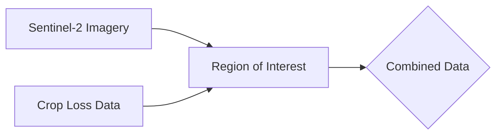
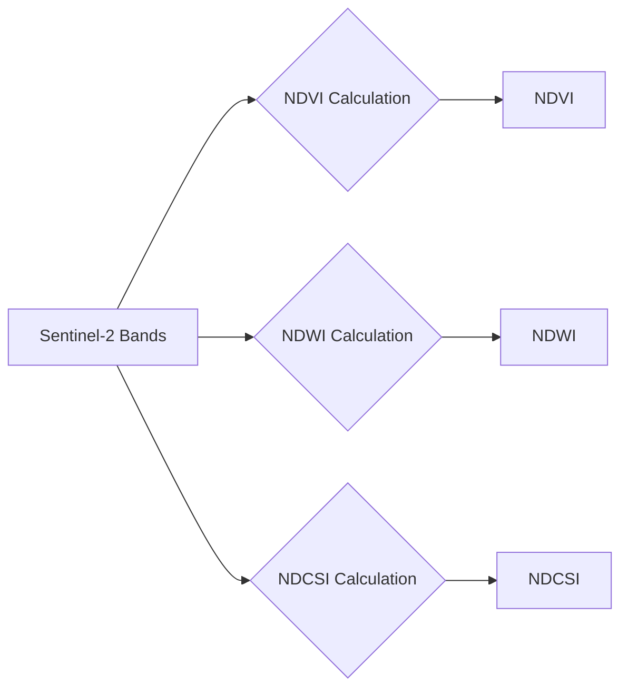
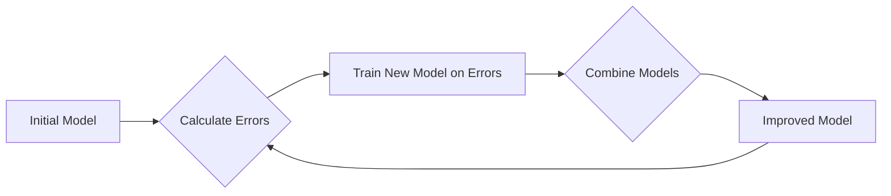
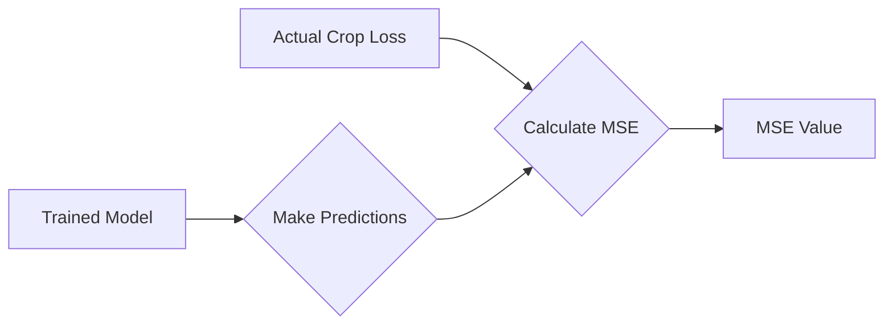

# CropPulse-Hackathon1
# Lightweight Geospatial ML Pipeline for Drought Stress Detection (Hackathon Guide)

# Crop Loss Prediction using Sentinel-2 and LightGBM

This document explains the process of predicting crop loss using Sentinel-2 satellite imagery and the LightGBM gradient boosting algorithm.

## 1. Introduction

Crop loss prediction is crucial for food security and agricultural planning. By leveraging remote sensing data and machine learning, we can estimate potential crop losses before harvest, enabling timely interventions.

## 2. Data Sources

*   **Sentinel-2:** Sentinel-2 is a European Space Agency (ESA) satellite mission that provides high-resolution optical imagery of the Earth's surface. We use Sentinel-2 data to extract vegetation indices that are indicative of crop health.
*   **Crop Loss Data:** This is the ground truth data representing actual crop losses in the region of interest. This data is essential for training the machine learning model.

## 3. Methodology

The crop loss prediction process involves the following steps:

### 3.1. Data Acquisition

*   **Sentinel-2 Data:** We acquire Sentinel-2 imagery for the region of interest (Nord Rhine-Westphalia in this case) and a specific time period (e.g., 2020-2021).
*   **Crop Loss Data:** We obtain crop loss data for the same region and time period. This data should ideally be in a format that can be linked to the Sentinel-2 imagery (e.g., by location).

Here's a Mermaid diagram illustrating the data acquisition process:



**Code Example:**

```python
import ee

# Define region of interest (Nord Rhine-Westphalia)
roi = ee.Geometry.Polygon(
        [[[6.0, 50.5],
          [9.0, 50.5],
          [9.0, 52.5],
          [6.0, 52.5]]])

# Define time range
start_date = '2020-01-01'
end_date = '2021-12-31'

# Load Sentinel-2 data
sentinel2 = ee.ImageCollection('COPERNICUS/S2_SR').filterDate(start_date, end_date).filterBounds(roi)
```

### 3.2. Feature Extraction

We extract the following vegetation indices from the Sentinel-2 imagery:

*   **NDVI (Normalized Difference Vegetation Index):** A measure of vegetation greenness, calculated as (NIR - Red) / (NIR + Red), where NIR is the near-infrared band and Red is the red band.
*   **NDWI (Normalized Difference Water Index):** A measure of vegetation water content, calculated as (Green - NIR) / (Green + NIR), where Green is the green band.
*   **NDCSI (Normalized Difference Clay Soil Index):** A measure of clay mineral content, calculated as (SWIR1 - SWIR2) / (SWIR1 + SWIR2), where SWIR1 and SWIR2 are shortwave infrared bands.

These indices provide information about the health and condition of the crops.

Here's a Mermaid diagram illustrating the feature extraction process:



**Code Example:**

```python
def calculate_ndvi(image):
    ndvi = image.normalizedDifference(['B8', 'B4']).rename('NDVI')
    return image.addBands(ndvi)

def calculate_ndwi(image):
    ndwi = image.normalizedDifference(['B3', 'B8']).rename('NDWI')
    return image.addBands(ndwi)

def calculate_ndcsi(image):
    ndcsi = image.normalizedDifference(['B11', 'B12']).rename('NDCSI')
    return image.addBands(ndcsi)

sentinel2_ndvi = sentinel2.map(calculate_ndvi)
sentinel2_ndwi = sentinel2.map(calculate_ndwi)
sentinel2_ndcsi = sentinel2.map(calculate_ndcsi)
```

### 3.3. Data Preparation

*   We combine the extracted vegetation indices with the crop loss data to create a training dataset.
*   The data is structured into a pandas DataFrame, with the vegetation indices as features and the crop loss as the target variable.
*   The target variable (crop loss) is transformed using a logarithmic transformation (np.log1p) to handle skewed distributions.
*   The data is split into training and validation sets to evaluate the model's performance.

Here's a Mermaid diagram illustrating the data preparation process:

```mermaid
graph LR
    A[NDVI] --> B{Combine with Crop Loss Data};
    C[NDWI] --> B;
    D[NDCSI] --> B;
    B --> E[Pandas DataFrame];
    E --> F{Log Transformation (np.log1p)};
    F --> G{Train/Validation Split};
```

**Code Example:**

```python
import pandas as pd
import numpy as np
from sklearn.model_selection import train_test_split

# Convert training data to pandas DataFrame
features = []
labels = []
# Assuming training_data is a list of dictionaries
for item in training_data['features']:
    properties = item['properties']
    features.append([properties['NDVI'], properties['NDWI'], properties['NDCSI']])
    labels.append(properties['crop_loss'])

df = pd.DataFrame(features, columns=['NDVI', 'NDWI', 'NDCSI'])
df['crop_loss'] = labels

# Prepare data for LightGBM
X = df[['NDVI', 'NDWI', 'NDCSI']]
y = np.log1p(df['crop_loss'].values)  # Use log1p transformation

X_train, X_validation, y_train, y_validation = train_test_split(X, y, test_size=0.2, random_state=42)
```

### 3.4. Model Training

We use the LightGBM (Light Gradient Boosting Machine) algorithm to train a predictive model.

#### What is Gradient Boosting?

Gradient boosting is a machine learning technique that combines multiple weak learners (typically decision trees) to create a strong learner. It works by iteratively adding new models that correct the errors made by previous models.

Key concepts in gradient boosting:

*   **Weak Learners:** Simple models (e.g., decision trees with limited depth) that perform slightly better than random guessing.
*   **Ensemble:** A collection of weak learners that work together to make predictions.
*   **Sequential Training:** Models are trained sequentially, with each new model focusing on the errors made by previous models.
*   **Loss Function:** A function that measures the difference between the predicted values and the actual values. The goal of gradient boosting is to minimize this loss function.

Here's a Mermaid diagram illustrating the gradient boosting process:



**Code Example:**

```python
import lightgbm as lgb

def light_gbm_model_run(train_x, train_y, validation_x, validation_y):
    params = {
        "objective" : "regression",
        "metric" : "rmse",
        "num_leaves" : 100,
        "learning_rate" : 0.001,
        "bagging_fraction" : 0.6,
        "feature_fraction" : 0.6,
        "bagging_frequency" : 6,
        "bagging_seed" : 42,
        "verbosity" : -1,
        "seed": 42
    }

    lg_train = lgb.Dataset(train_x, label=train_y)
    lg_validation = lgb.Dataset(validation_x, label=validation_y)
    evals_result_lgbm = {}

    model_light_gbm = lgb.train(params, lg_train, 5000,
                      valid_sets=[lg_train, lg_validation],
                      early_stopping_rounds=100,
                      verbose_eval=150,
                      evals_result=evals_result_lgbm )

    pred_test_light_gbm = np.expm1(model_light_gbm.predict(validation_x, num_iteration=model_light_gbm.best_iteration ))

    return pred_test_light_gbm, model_light_gbm, evals_result_lgbm

# Training and output of LightGBM Model
predictions_test_y_light_gbm, model_lgbm, evals_result = light_gbm_model_run(X_train, y_train, X_validation, y_validation)
print('Output of LightGBM Model training..')
```

### 3.5. Model Evaluation

We evaluate the model's performance using the Mean Squared Error (MSE) metric. MSE measures the average squared difference between the predicted crop losses and the actual crop losses.

Here's a Mermaid diagram illustrating the model evaluation process:



**Code Example:**

```python
from sklearn.metrics import mean_squared_error
mse = mean_squared_error(np.expm1(y_validation), predictions_test_y_light_gbm)
print('Mean Squared Error:', mse)
```

## 4. Code Implementation

The Python code uses the following libraries:

*   **ee:** Google Earth Engine API for accessing and processing satellite imagery.
*   **pandas:** Data manipulation and analysis library.
*   **lightgbm:** LightGBM gradient boosting framework.
*   **sklearn:** Scikit-learn library for machine learning tasks (e.g., train-test split, evaluation metrics).

The code performs the following steps:

1.  Authenticates with Google Earth Engine.
2.  Defines the region of interest and time period.
3.  Loads Sentinel-2 data and calculates vegetation indices.
4.  Extracts features and labels from the Sentinel-2 data.
5.  Prepares the data for LightGBM.
6.  Trains the LightGBM model.
7.  Evaluates the model's performance.

## 5. Conclusion

This document provides an overview of the crop loss prediction process using Sentinel-2 imagery and the LightGBM algorithm. By combining remote sensing data and machine learning, we can develop effective tools for monitoring crop health and predicting potential losses.
