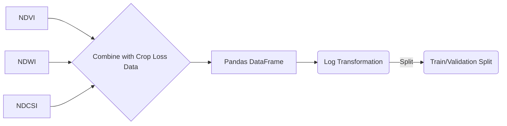

# Crop Loss Prediction using Sentinel-2 and LightGBM

This document explains the process of predicting crop loss using Sentinel-2 satellite imagery and the LightGBM gradient boosting algorithm.

## 1. Introduction

Crop loss prediction is crucial for food security and agricultural planning. By leveraging remote sensing data and machine learning, we can estimate potential crop losses before harvest, enabling timely interventions.

## 2. Google Earth Engine

This section provides JavaScript code to display the region of interest and the extracted layers with vegetation indices using the Google Earth Engine API. You can use this code in the Google Earth Engine Code Editor: https://code.earthengine.google.com

Google Earth Engine is a cloud-based platform for processing satellite imagery and other geospatial data. In this project, we use Sentinel-2 satellite imagery to calculate vegetation indices that are indicative of crop health.

Sentinel-2 is a European Space Agency (ESA) satellite mission that provides high-resolution optical imagery of the Earth's surface. Sentinel-2 provides 13 spectral bands in the visible, near-infrared, and shortwave infrared regions of the electromagnetic spectrum. These bands can be used to calculate various vegetation indices, such as NDVI, NDWI, and NDCSI.

*   **NDVI (Normalized Difference Vegetation Index):** A measure of vegetation greenness, calculated as (NIR - Red) / (NIR + Red), where NIR is the near-infrared band (B8) and Red is the red band (B4). NDVI values range from -1 to 1, with higher values indicating greater vegetation greenness.
*   **NDWI (Normalized Difference Water Index):** A measure of vegetation water content, calculated as (Green - NIR) / (Green + NIR), where Green is the green band (B3) and NIR is the near-infrared band (B8). NDWI values range from -1 to 1, with higher values indicating greater vegetation water content.
*   **NDCSI (Normalized Difference Clay Soil Index):** A measure of clay mineral content, calculated as (SWIR1 - SWIR2) / (SWIR1 + SWIR2), where SWIR1 is the shortwave infrared band (B11) and SWIR2 is the shortwave infrared band (B12). NDCSI values range from -1 to 1.

The following JavaScript code shows how to display the region of interest and the extracted layers with vegetation indices using the Google Earth Engine API. This code needs to be adapted to properly display our layers.

```javascript
var centerLon = 8.00; // Example longitude
var centerLat = 50.00; // Example latitude
var sideLengthMeters = 100;
var halfSideMeters = sideLengthMeters / 2;
var latOffsetDegrees = halfSideMeters / 111320;
var lonOffsetDegrees = halfSideMeters / (111320 * Math.cos(centerLat * Math.PI/180));
var roi = ee.Geometry.Polygon(
        [[[6.0, 50.5],
          [9.0, 50.5],
          [9.0, 52.5],
          [6.0, 52.5]]]);
var hectareTile = roi;
var s2Collection = ee.ImageCollection('COPERNICUS/S2_SR_HARMONIZED')
                  .filter(ee.Filter.date('2018-05-01', '2018-05-08'))
                  .filterBounds(hectareTile);
function maskS2clouds(image) {
  var qa = image.select('QA60');
  var cloudBitMask = 1 << 10;
  var cirrusBitMask = 1 << 11;
  var mask = qa.bitwiseAnd(cloudBitMask).eq(0)
      .and(qa.bitwiseAnd(cirrusBitMask).eq(0));
  return image.updateMask(mask).divide(10000)
              .select("B.*")
              .copyProperties(image, ["system:time_start"]);
}
var s2CloudMasked = s2Collection.map(maskS2clouds);
var medianS2Image = s2CloudMasked.median(); // Takes the median of each pixel over time
var s2VisParams = {
  bands: ['B4', 'B3', 'B2'], // Red, Green, Blue
  min: 0.0,
  max: 0.3 // Typical range for good visualization, can be adjusted
};
var s2HectareVis = medianS2Image.clip(hectareTile);
var s2ValuesHectare = medianS2Image.reduceRegion({
  reducer: ee.Reducer.mean(), // Mean reflectance per band
  geometry: hectareTile,
  scale: 10, maxPixels: 2e9
});
Map.centerObject(hectareTile, 17); // Strong zoom to the tile
Map.addLayer(hectareTile, {color: 'FFFF00'}, '1 Hectare Tile Border (S2)'); // Yellow border
Map.addLayer(s2HectareVis, s2VisParams, 'Sentinel-2 (1 Hectare)');

var worldCereal = ee.ImageCollection("ESA/WorldCereal/2021/V100").filter(ee.Filter.eq('aez_id', 6)).filter(ee.Filter.eq('product', 'temporarycrops')).filter(ee.Filter.eq('season', 'tc-annual')).first()

var wcVisParams = {min: 0, max: 100, palette: ['black', 'green']};

Map.addLayer(worldCereal.clip(hectareTile), wcVisParams, 'WorldCereal (1 Hectare)');

var ndvi = medianS2Image.normalizedDifference(['B8', 'B4']).rename('NDVI');
var ndwi = medianS2Image.normalizedDifference(['B3', 'B8']).rename('NDWI');
var ndcsi = medianS2Image.normalizedDifference(['B11', 'B12']).rename('NDCSI');

var ndviVisParams = {min: -1, max: 1, palette: ['red', 'yellow', 'green']};
var ndwiVisParams = {min: -1, max: 1, palette: ['blue', 'white', 'green']};
var ndcsiVisParams = {min: -1, max: 1, palette: ['brown', 'white', 'green']};

Map.addLayer(ndvi.clip(hectareTile), ndviVisParams, 'NDVI (1 Hectare)');
Map.addLayer(ndwi.clip(hectareTile), ndwiVisParams, 'NDWI (1 Hectare)');
Map.addLayer(ndcsi.clip(hectareTile), ndcsiVisParams, 'NDCSI (1 Hectare)');

print('Mean Sentinel-2 reflectance values in 1-hectare tile:', s2ValuesHectare)


```

## 3. Data Sources

*   **Sentinel-2:** Sentinel-2 is a European Space Agency (ESA) satellite mission that provides high-resolution optical imagery of the Earth's surface. We use Sentinel-2 data to extract vegetation indices that are indicative of crop health.
*   **Crop Loss Data:** This is the ground truth data representing actual crop losses in the region of interest. This data is essential for training the machine learning model.
*   **WorldCereal 10 m 2021:** The "WorldCereal 10 m 2021" product suite from the European Space Agency (ESA) consists of annual and seasonal cereal maps at a global level and the associated confidence intervals. These were generated as part of the ESA-WorldCereal project.

    This collection contains up to 106 images for each agro-ecological zone (AEZ), all processed taking into account the respective regional seasonality and should be considered as stand-alone products.

    WorldCereal Seasons:

    *   tc-annual: An annual cycle, defined up to the end of the last vegetation period considered in an AEZ
    *   tc-wintercereals: the main cereal season in an AEZ
    *   tc-springcereals: optional season for spring cereals, only defined in certain time zones
    *   tc-maize-main: the main maize season defined in an AEZ
    *   tc-maize-second: optional second maize season, only defined in certain AEZs

    Available products:

    *   temporarycrops
    *   Maize
    *   wintercereals
    *   springcereals
    *   Irrigation

    Each product (image) has a binary classification (0 or 100) and a confidence range (0–100).

    The collection should be filtered with one or more of the following image properties:

    *   "aez_id", the ID of the AEZ to which the image belongs
    *   product, which describes the "WorldCereal" product name of the image
    *   season, which describes the season for which the image is valid.

## 4. Methodology

The crop loss prediction process involves the following steps:

### 4.1. Data Acquisition

*   **Sentinel-2 Data:** We acquire Sentinel-2 imagery for the region of interest (Nord Rhine-Westphalia in this case) and a specific time period (e.g., 2020-2021).
*   **Crop Loss Data:** We obtain crop loss data for the same region and time period. This data should ideally be in a format that can be linked to the Sentinel-2 imagery (e.g., by location).

Here's a Mermaid diagram illustrating the data acquisition process:


**Code Example:**

```python
import ee

# Define region of interest (Nord Rhine-Westphalia)
roi = ee.Geometry.Polygon(
        [[[6.0, 50.5],
          [9.0, 50.5],
          [9.0, 52.5],
          [6.0, 52.5]]])

# Define time range
start_date = '2020-01-01'
end_date = '2021-12-31'

# Load Sentinel-2 data
sentinel2 = ee.ImageCollection('COPERNICUS/S2_SR').filterDate(start_date, end_date).filterBounds(roi)
```

### 4.2. Feature Extraction

We extract the following vegetation indices from the Sentinel-2 imagery:

*   **NDVI (Normalized Difference Vegetation Index):** A measure of vegetation greenness, calculated as (NIR - Red) / (NIR + Red), where NIR is the near-infrared band and Red is the red band.
*   **NDWI (Normalized Difference Water Index):** A measure of vegetation water content, calculated as (Green - NIR) / (Green + NIR), where Green is the green band.
*   **NDCSI (Normalized Difference Clay Soil Index):** A measure of clay mineral content, calculated as (SWIR1 - SWIR2) / (SWIR1 + SWIR2), where SWIR1 and SWIR2 are shortwave infrared bands.

These indices provide information about the health and condition of the crops.

Here's a Mermaid diagram illustrating the feature extraction process:


**Code Example:**

```python
def calculate_ndvi(image):
    ndvi = image.normalizedDifference(['B8', 'B4']).rename('NDVI')
    return image.addBands(ndvi)

def calculate_ndwi(image):
    ndwi = image.normalizedDifference(['B3', 'B8']).rename('NDWI')
    return image.addBands(ndvi)

def calculate_ndcsi(image):
    ndcsi = image.normalizedDifference(['B11', 'B12']).rename('NDCSI')
    return image.addBands(ndcsi)

sentinel2_ndvi = sentinel2.map(calculate_ndvi)
sentinel2_ndwi = sentinel2.map(calculate_ndwi)
sentinel2_ndcsi = sentinel2.map(calculate_ndcsi)
```

### 4.3. Data Preparation

*   We combine the extracted vegetation indices with the crop loss data to create a training dataset.
*   The data is structured into a pandas DataFrame, with the vegetation indices as features and the crop loss as the target variable.
*   The target variable (crop loss) is transformed using a logarithmic transformation (np.log1p) to handle skewed distributions.
*   The data is split into training and validation sets to evaluate the model's performance.

Here's a Mermaid diagram illustrating the data preparation process:



**Code Example:**

```python
import pandas as pd
import numpy as np
from sklearn.model_selection import train_test_split

# Convert training data to pandas DataFrame
features = []
labels = []
# Assuming training_data is a list of dictionaries
for item in training_data['features']:
    properties = item['properties']
    features.append([properties['NDVI'], properties['NDWI'], properties['NDCSI']])
    labels.append(properties['crop_loss'])

df = pd.DataFrame(features, columns=['NDVI', 'NDWI', 'NDCSI'])
df['crop_loss'] = labels

# Prepare data for LightGBM
X = df[['NDVI', 'NDWI', 'NDCSI']]
y = np.log1p(df['crop_loss'].values)  # Use log1p transformation

X_train, X_validation, y_train, y_validation = train_test_split(X, y, test_size=0.2, random_state=42)

# Display the correlation matrix
correlation_matrix = df[['NDVI', 'NDWI', 'NDCSI', 'crop_loss']].corr()
print(correlation_matrix)
```

### 4.4. Model Training

We use the LightGBM (Light Gradient Boosting Machine) algorithm to train a predictive model.

#### What is Gradient Boosting?

Gradient boosting is a machine learning technique that combines multiple weak learners (typically decision trees) to create a strong learner. It works by iteratively adding new models that correct the errors made by previous models.

Key concepts in gradient boosting:

*   **Weak Learners:** Simple models (e.g., decision trees with limited depth) that perform slightly better than random guessing.
*   **Ensemble:** A collection of weak learners that work together to make predictions.
*   **Sequential Training:** Models are trained sequentially, with each new model focusing on the errors made by previous models.
*   **Loss Function:** A function that measures the difference between the predicted values and the actual values. The goal of gradient boosting is to minimize this loss function. Common loss functions include Mean Squared Error (MSE) for regression tasks and Log Loss for classification tasks.

The gradient boosting algorithm works as follows:

1.  Initialize the model with a constant value (e.g., the mean of the target variable).
2.  For each iteration:
    *   Calculate the residuals (the difference between the actual values and the predicted values).
    *   Train a weak learner (e.g., a decision tree) to predict the residuals.
    *   Update the model by adding the predictions of the weak learner, scaled by a learning rate. The learning rate controls the contribution of each weak learner to the overall model.
3.  Repeat steps 2 until a stopping criterion is met (e.g., a maximum number of iterations or a minimum improvement in the loss function).

Here's a Mermaid diagram illustrating the gradient boosting process:


**Code Example:**

```python
import lightgbm as lgb

def light_gbm_model_run(train_x, train_y, validation_x, validation_y):
    params = {
        "objective" : "regression",
        "metric" : "rmse",
        "num_leaves" : 100,
        "learning_rate" : 0.001,
        "bagging_fraction" : 0.6,
        "feature_fraction" : 0.6,
        "bagging_frequency" : 6,
        "bagging_seed" : 42,
        "verbosity" : -1,
        "seed": 42
    }

    lg_train = lgb.Dataset(train_x, label=train_y)
    lg_validation = lgb.Dataset(validation_x, label=validation_y)
    evals_result_lgbm = {}

    model_light_gbm = lgb.train(params, lg_train, 5000,
                      valid_sets=[lg_train, lg_validation],
                      early_stopping_rounds=100,
                      verbose_eval=150,
                      evals_result=evals_result_lgbm )

    pred_test_light_gbm = np.expm1(model_light_gbm.predict(validation_x, num_iteration=model_light_gbm.best_iteration ))

    return pred_test_light_gbm, model_light_gbm, evals_result_lgbm

# Training and output of LightGBM Model
predictions_test_y_light_gbm, model_lgbm, evals_result = light_gbm_model_run(X_train, y_train, X_validation, y_validation)
print('Output of LightGBM Model training..')
```

### 4.5. Model Evaluation

We evaluate the model's performance using the Mean Squared Error (MSE) metric. MSE measures the average squared difference between the predicted crop losses and the actual crop losses.

Here's a Mermaid diagram illustrating the model evaluation process:


**Code Example:**

```python
from sklearn.metrics import mean_squared_error
mse = mean_squared_error(np.expm1(y_validation), predictions_test_y_light_gbm)
print('Mean Squared Error:', mse)
```

## 5. Code Implementation

The Python code uses the following libraries:

*   **ee:** Google Earth Engine API for accessing and processing satellite imagery.
*   **pandas:** Data manipulation and analysis library.
*   **lightgbm:** LightGBM gradient boosting framework.
*   **sklearn:** Scikit-learn library for machine learning tasks (e.g., train-test split, evaluation metrics).

The code performs the following steps:

1.  Authenticates with Google Earth Engine.
2.  Defines the region of interest and time period.
3.  Loads Sentinel-2 data and calculates vegetation indices.
4.  Extracts features and labels from the Sentinel-2 data.
5.  Prepares the data for LightGBM.
6.  Trains the LightGBM model.
7.  Evaluates the model's performance.

## 6. Conclusion

This document provides an overview of the crop loss prediction process using Sentinel-2 imagery and the LightGBM algorithm. By combining remote sensing data and machine learning, we can develop effective tools for monitoring crop health and predicting potential losses.
